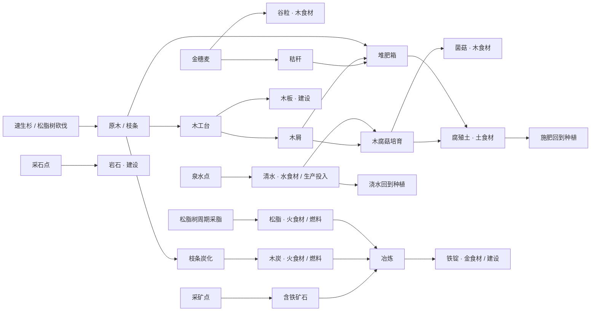

# Demo V1 首批资源与生产关系

> 日期：2026-10-10。状态：资源关系设计稿；唯一ID和食材名单为实施建议，价格、数量、供养值、耗时尚未配数。
> 范围及结算规范见[Demo V1计划](demo-v1-plan.md)。四植物、三天然资源点、四加工工艺已由用户确认；本表将工艺细分为可实现配方，不新增养殖、水产或榨油。

## 1. 首批材料表

五行编码与上游约定一致：金为`gold`。所有材料可在共享库存堆叠；形态只描述资源，不引入液体/气体模拟。多用途是标签，不能要求一件材料只属于一个用途。

| ID建议 | 名称 | 五行 | 形态/阶段 | 来源 | V1消费者/去向 | 可供养 |
|---|---|---|---|---|---|---|
| golden_wheat_seed | 金穗麦种子 | 木 | 固体/初级 | 市场 | 金穗麦播种 | 否 |
| fast_fir_seed | 速生杉苗 | 木 | 固体/初级 | 市场 | 速生杉种植 | 否 |
| resin_tree_seed | 松脂树苗 | 木 | 固体/初级 | 市场 | 松脂树种植 | 否 |
| wood_decay_spawn | 木腐菇菌种 | 木 | 固体/初级 | 市场 | 每轮木腐菇培育 | 否 |
| grain | 谷粒 | 木 | 固体/初级 | 金穗麦 | 木订单、销售 | 是 |
| straw | 秸秆 | 木 | 固体/初级 | 金穗麦 | 堆肥、销售；V2饲料/培养料候选 | 否 |
| raw_wood | 原木 | 木 | 固体/初级 | 速生杉/松脂树砍伐 | 木材加工、建设、销售 | 否 |
| twig | 枝条 | 木 | 固体/初级 | 树木砍伐 | 炭化、粉碎、堆肥、销售 | 否 |
| resin | 松脂 | 火 | 固体/初级 | 成熟松脂树周期采脂 | 火订单、冶炼燃料、销售 | 是 |
| mushroom | 木腐菇 | 木 | 固体/初级 | 木腐菇培育 | 木订单、销售 | 是 |
| humus | 腐殖土 | 土 | 固体/中间 | 堆肥/木腐菇 | 施肥、土订单、销售 | 是 |
| raw_stone | 普通岩石 | 土 | 固体/初级 | 采石点 | 设施建设、销售 | 否 |
| iron_ore | 含铁矿石 | 土 | 固体/初级 | 采矿点 | 冶炼、销售 | 否 |
| clean_water | 清水 | 水 | 液体/初级 | 泉水点 | 浇水、菌菇培育、水订单、销售 | 是 |
| wood_chip | 木屑 | 木 | 固体/中间 | 锯切副产/粉碎 | 每轮木腐菇培养料、堆肥、销售 | 否 |
| wood_plank | 木板 | 木 | 固体/中间 | 锯切原木 | 设施建设、销售 | 否 |
| charcoal | 木炭 | 火 | 固体/中间 | 枝条炭化 | 火订单、冶炼燃料、销售 | 是 |
| iron_ingot | 铁锭 | 金 | 固体/中间 | 冶炼含铁矿石 | 金订单、设施建设、销售 | 是 |

首批18种物品，其中4种种植投入、14种产物/材料；不是18种生物。食材资格是独立布尔/用途标记，不能从`element`、形态或名称自动推断。

采购策略：种子/菌种和必要初级生产投入可购买；木屑等中间培养料如开放应急采购须明确列入市场配置。木板、木炭、铁锭、腐殖土等加工成品默认不开放采购，具体基础投入采购名单随初始预算定稿。任何开放采购的食材均通过订单防套利检查。

首次不新增“农业废料”万能物品；秸秆、枝条、木屑就是不同用途的有机原料。既可出售又可加工，避免为了循环新增只有名称区别的废料。种子返还不是首批默认产物，若配置引入，必须参与成本分摊。

## 2. 四植物与资源点

| 生产者ID建议 | 投入 | 产物 | 生命周期/限额 |
|---|---|---|---|
| golden_wheat | 种子、地格、水分/肥力 | 谷粒＋秸秆 | 生长完成一次采收，之后重种 |
| fast_fir | 树苗、地格、水分/肥力 | 原木＋枝条 | 成熟后砍伐，砍后重种 |
| resin_tree | 树苗、地格、水分/肥力 | 周期松脂；砍伐原木＋枝条 | 留树采脂或破坏性砍伐，操作互斥 |
| wood_decay_mushroom | 每轮菌种＋木屑＋水、适宜菌床 | 菌菇＋腐殖土 | 每轮必须重新消耗培养料，不无限使用旧培养料 |
| stone_source | 成功采集AP | 普通岩石 | 天然、无限储量、共享日容量 |
| ore_source | 成功采集AP | 含铁矿石 | 同上 |
| spring_source | 成功采集AP | 清水 | 同上 |

水分/肥力是土地环境；菌菇投入的清水和土地浇水不能无意重复计费。实施时明确培养用水是否同时补该格水分，标准成本按照真正独立的投入计算一次。

## 3. 四工艺、五个首批配方

| 配方ID建议 | 设施建议 | 输入关系 | 输出关系 | 主要目的 |
|---|---|---|---|---|
| saw_planks | 木工台 | 原木 | 木板＋少量木屑 | 建设与菌菇回收联产，成本分摊 |
| shred_wood | 木工台 | 原木或枝条（二选一配方变体） | 木屑 | 不建材时专门准备培养料 |
| char_twigs | 炭化炉 | 枝条 | 木炭 | 火食材及冶炼燃料 |
| compost_organics | 堆肥箱 | 秸秆或枝条或木屑（按配方变体） | 腐殖土 | 施肥回流与土食材 |
| smelt_iron | 小型冶炼炉 | 含铁矿石＋木炭或松脂（二选一燃料变体） | 铁锭 | 金食材及建设材料 |

工艺数与配方数不同：木工台承担锯切和粉碎；变体明确消费的物品和数量，不接受未定义的“任意有机物”。四设施的造价、占地、耗时、AP和产量待配置。

第一座木工台的必需造价不能包含仅由木工台产出的木板，首批冶炼炉不能强制要求尚未冶炼得到的铁锭；基础设施用可得的初级材料和元石启动，高级建设才使用加工材料，避免循环前置。

每个配方必须明确数值、投入、主产物、实际存在的副产物、成本分摊权重。副产物只有存在消费者或销售价值才独立登记；首批不额外加入木焦油、木醋液、灰烬、尾砂和可燃气体。

炭化炉不以“必须先有木炭”作为启动门槛，启动燃料/成本若需要，应选已有可得投入并计入配方。冶炼燃料来自松脂或炭化链，两条来源都不得免费；铁锭不能由普通岩石直接生成。

## 4. 五行供货与回流图

图中“原木/枝条”是为简洁合并的展示节点，实际配方分别引用具体ID；不是任意木材都能自动用于所有加工。所有可销售产物还能换元石；五行订单只接收食材清单中的物品。

五行路线：木为谷粒/菌菇，火为松脂/木炭，土为腐殖土，水为清水，金为铁锭。采石路线承担建设原料，不能仅凭土属性代替腐殖土的食材资格。

核心竞争：原木用于建设或准备培养料；枝条用于炭化或堆肥；木炭/松脂用于出售、火订单或冶炼；腐殖土用于出售、土订单或施肥。订单有限、生产有AP/时间/投入成本，循环中不存在无代价增殖。

## 5. 配数和检查入口

需要配数：每次产量、日限额、种子/菌种数量、价格、生长/加工周期、每轮培养料和燃料量、设施材料需求、标准成本分摊、供养值、订单需求及回款。每个数值配置带来源说明，避免把示意配方当成现实质量守恒。

资源关系检查至少覆盖：

- 来源存在，配方输入/输出ID均已登记；玩家可获取必要投入，设施建设不依赖自身唯一产物形成死锁。
- 不含养殖/水产前置，四植物加三资源点可进入首批所有加工。
- 主/副产物分摊权重和为1，非食材供养值为0，食材值为正。
- 多来源物品供养值固定；采脂和砍伐互斥，培养料每轮实耗。
- 五行食材各有自产路线；所有产物有建设、生产、供货或出售出口。
- 原物采购到订单回款无利差，建设、培养和冶炼没有免费循环或重复奖励。

本表尚未进行V1数值模拟或45天运行验收；阶段完成后报告应同时列出真实投入、收益、订单和生产回流。
